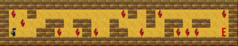

```bash
	███████╗ ██████╗     ██╗      ██████╗ ███╗   ██╗ ██████╗
	██╔════╝██╔═══██╗    ██║     ██╔═══██╗████╗  ██║██╔════╝
	███████╗██║   ██║    ██║     ██║   ██║██╔██╗ ██║██║  ███╗
	╚════██║██║   ██║    ██║     ██║   ██║██║╚██╗██║██║   ██║
	███████║╚██████╔╝    ███████╗╚██████╔╝██║ ╚████║╚██████╔╝
	╚══════╝ ╚═════╝     ╚══════╝ ╚═════╝ ╚═╝  ╚═══╝ ╚═════╝
```

**This project is a very small 2D game. Its purpose is to make you work with\
textures, sprites, and some other very basic gameplay elements.**

[](./dcs/game.gif)

 Skills | Grade |
:------:|:-----:|
[**Imperative programming**] [**Graphics**] | **119%**

<!-- [](https://github.com/JaeSeoKim/badge42) -->

## [Specifications](https://github.com/faleite/so_long/blob/main/dcs/README.md)

## **Links**
- **MinilibX**
  - [Documentation](https://harm-smits.github.io/42docs/libs/minilibx)
  - [Man MLX](https://qst0.github.io/ft_libgfx/man_mlx.html)
  - [42-cli](https://github.com/herbievine/42-cli)
  - [Get Started](https://aurelienbrabant.fr/blog/getting-started-with-the-minilibx)
  - [Video Tutorial Oceano](https://youtu.be/bYS93r6U0zg) -> [Repository](https://github.com/suspectedoceano/mlx)
- [**Game Graphics**](https://itch.io/game-assets/tag-16x16)
- [**Game Sprites**](https://opengameart.org/content/2d-platformer-art-assets-from-henry-software)
- [**PNG to XPM Option 1**](https://convertio.co/png-xpm/)
- [**PNG to XPM Option 2**](https://anyconv.com/png-to-xpm-converter/)
- [**Tutorial**](https://reactive.so/post/42-a-comprehensive-guide-to-so_long)
- [**42 Guide**](https://42-cursus.gitbook.io/guide/)
- [**So Long Eval**](https://github.com/rphlr/42-Evals/tree/main/Rank02/so_long)
- [**Subject**](https://cdn.intra.42.fr/pdf/pdf/89621/en.subject.pdf)
