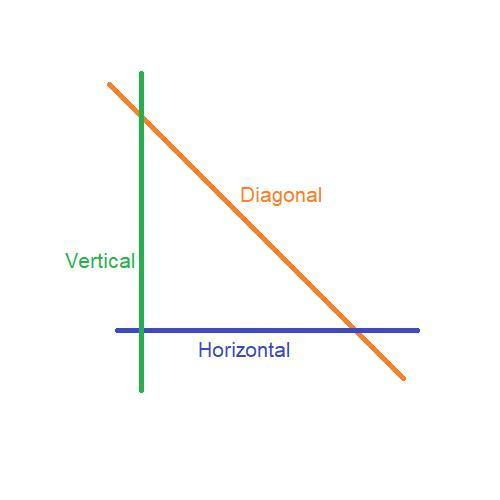

# Notas

## Game
1. O objetivo do jogador é coletar todos os presentes colecionáveis no mapa e\
depois escapar escolhendo o caminho mais curto possível.
2. As teclas W, A, S e D devem ser usadas para mover o personagem principal.
  - Se preferir, você pode usar ZQSD ou as teclas de seta do teclado para mover\
seu personagem principal.
3. O jogador deve ser capaz de se mover nestas 4 direções: para cima, para\
baixo, para a esquerda, para a direita.
4. O jogador não deve ser capaz de se mover contra paredes.
5. A cada movimento, o número atual de movimentos deve ser exibido no shell.
6. É necessário utilizar uma visualização 2D (de cima para baixo ou de perfil).
7. O jogo não precisa ser em tempo real.
8. Embora os exemplos dados mostrem um tema de golfinho, você pode criar o\
mundo que deseja querer.

## Gestão gráfica
1. Seu programa deve exibir a imagem em uma janela.
2. A gestão da sua janela deve permanecer tranquila (mudando para outra\
janela, minimizando e assim por diante).
3. Pressionar ESC deve fechar a janela e sair do programa de forma limpa.
4. Clicar na cruz na moldura da janela deve fechar a janela e sair do\
programa de maneira limpa.
5. O uso das imagens do MiniLibX é obrigatório.

## Checagem do Mapa
1. Mapa deve ser do tipo .ber, se não, exibir mensagem de erro
2. So pode haver um mapa (argc == 2), se não, exibir mensagem de erro
3. Mapa deve conter apenas:
  - **E** 1 Saida
  - **C** Pelo menos 1 Coletavel
  - **P** 1 Posicao inicial

*Se o mapa contiver caracteres duplicados (saída/início), você deverá\
exibir uma mensagem de erro.*

4. Mapa deve ser retangular (quadrado ou retângulo), se não, exibir mensagem de erro
5. Mapa deve ser fechado/cercado por paredes, se não, exibir mensagem de erro
6. Mapa ter um caminho válido, se não, exibir mensagem de erro **(flood fill)**
7. Ser capaz de analisar qualquer tipo de mapa, desde que respeite as regras acima

*Se qualquer configuração incorreta de qualquer tipo for encontrada no arquivo,\
o programa deve sair de forma limpa e retornar "Error\n" seguido de uma mensagem\
de erro a sua escolha.*

### Exemplo para a checagem e copia de Mapa
- Linhas:

  [](./linhas.jpg)

- Mapas:
```
1111111111111
10010000000C1
1000011111001
1P0011E000001
1111111111111
```

```
1111111111111111111111111111111111
1E0000000000000C00000C000000000001
1010010100100000101001000000010101
1010010010101010001001000000010101
1P0000000C00C0000000000000000000C1
1111111111111111111111111111111111
```

## Function Hook
```c
	// Escuta as teclas (keypress)
	mlx_hook(data.win_ptr, 2, 1L, on_keypress, &data);
	mlx_hook(data.win_ptr, KeyPress, KeyPressMask, on_keypress, &data);
	// Escuta as teclas (keyrelease)
	mlx_hook(data.win_ptr, KeyRelease, KeyReleaseMask, on_keypress, &data);

	// Escuta o movimento do mouse para fechar janela no click do botão x
	mlx_hook(data.win_ptr, 17, 0L, (int (*)(void *param))destroy_window, &data);
	mlx_hook(data.win_ptr, DestroyNotify, StructureNotifyMask, (int (*)(void *param))destroy_window, &data);
```

## Bonus
 - Você ganhará pontos extras se:
  - Faça o jogador perder ao tocar em uma patrulha inimiga.
  - Adicione alguma animação de sprite.
  - Exibir a contagem de movimentos diretamente na tela em vez de escrevê-la\
  no shell.
