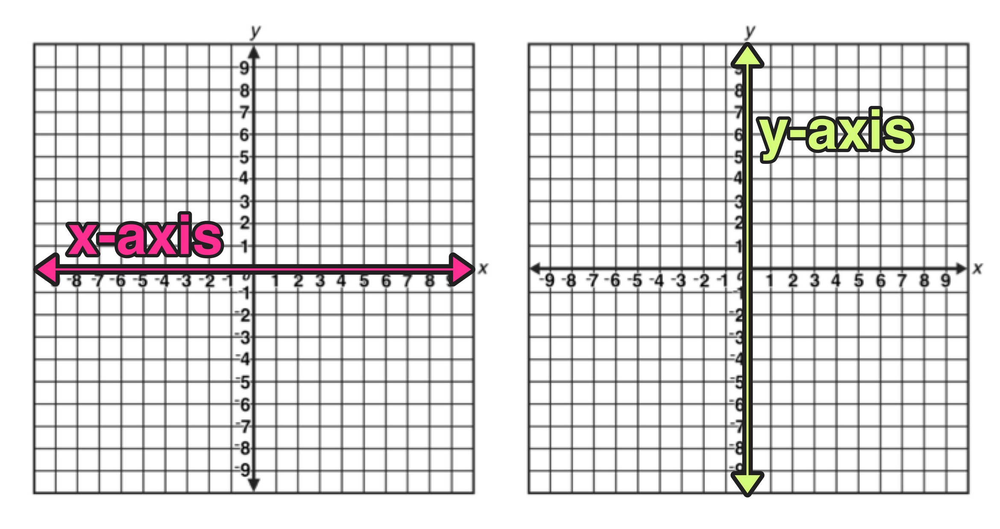

# Notas

## Game
1. O objetivo do jogador é coletar todos os presentes colecionáveis no mapa e\
depois escapar escolhendo o caminho mais curto possível.
2. As teclas W, A, S e D devem ser usadas para mover o personagem principal.
  - Se preferir, você pode usar ZQSD ou as teclas de seta do teclado para mover\
seu personagem principal.
3. O jogador deve ser capaz de se mover nestas 4 direções: para cima, para\
baixo, para a esquerda, para a direita.
4. O jogador não deve ser capaz de se mover contra paredes.
5. A cada movimento, o número atual de movimentos deve ser exibido no shell.
6. É necessário utilizar uma visualização 2D (de cima para baixo ou de perfil).
7. O jogo não precisa ser em tempo real.
8. Embora os exemplos dados mostrem um tema de golfinho, você pode criar o\
mundo que deseja querer.

## Gestão gráfica
1. Seu programa deve exibir a imagem em uma janela.
2. A gestão da sua janela deve permanecer tranquila (mudando para outra\
janela, minimizando e assim por diante).
3. Pressionar ESC deve fechar a janela e sair do programa de forma limpa.
4. Clicar na cruz na moldura da janela deve fechar a janela e sair do\
programa de maneira limpa.
5. O uso das imagens do MiniLibX é obrigatório.

---

## Checagem do Mapa
1. Mapa deve ser do tipo .ber, se não, exibir mensagem de erro
2. So pode haver um mapa (argc == 2), se não, exibir mensagem de erro
3. Mapa deve conter apenas:
  - **E** 1 Saida
  - **C** Pelo menos 1 Coletavel
  - **P** 1 Posicao inicial

*Se o mapa contiver caracteres duplicados (saída/início), você deverá\
exibir uma mensagem de erro.*

4. Mapa deve ser retangular (quadrado ou retângulo), se não, exibir mensagem de erro
5. Mapa deve ser fechado/cercado por paredes, se não, exibir mensagem de erro
6. Mapa ter um caminho válido, se não, exibir mensagem de erro **(flood fill)**
7. Ser capaz de analisar qualquer tipo de mapa, desde que respeite as regras acima

*Se qualquer configuração incorreta de qualquer tipo for encontrada no arquivo,\
o programa deve sair de forma limpa e retornar "Error\n" seguido de uma mensagem\
de erro a sua escolha.*

### Exemplo para a checagem e copia de Mapa
- Linhas:

  [](./linhas.jpg)

- Mapas:
```about:blank#blocked
1111111111111
10010000000C1
1000011111001
1P0011E000001
1111111111111
```

```
1111111111111111111111111111111111
1E0000000000000C00000C000000000001
1010010100100000101001000000010101
1010010010101010001001000000010101
1P0000000C00C0000000000000000000C1
1111111111111111111111111111111111
```

## Flood Fill
- Flood fill é um algoritmo de preenchimento de área. Ele é usado em programas\
de pintura (como o Paint do Windows), em editores de imagem e em jogos\
(geralmente para preencher áreas de uma cor com outra cor).
- O algoritmo de preenchimento de área é um algoritmo recursivo que\
verifica se um pixel está dentro de uma área e, se estiver, o preenche\
com uma cor especificada. O algoritmo de preenchimento de área é\
também conhecido como algoritmo de inundação.

### Eixo do Mapa
[](./axis_yx.jpg)


### Links
- [Video algorithm](https://www.youtube.com/watch?v=VuiXOc81UDM&t=141)

---

## Function Hook
```c
	// Escuta as teclas (keypress)
	mlx_hook(data.win_ptr, 2, 1L, on_keypress, &data);
	mlx_hook(data.win_ptr, KeyPress, KeyPressMask, on_keypress, &data);
	// Escuta as teclas (keyrelease)
	mlx_hook(data.win_ptr, KeyRelease, KeyReleaseMask, on_keypress, &data);

	// Escuta o movimento do mouse para fechar janela no click do botão x
	mlx_hook(data.win_ptr, 17, 0L, (int (*)(void *param))destroy_window, &data);
	mlx_hook(data.win_ptr, DestroyNotify, StructureNotifyMask, (int (*)(void *param))destroy_window, &data);
```
---

## Bonus
 - Você ganhará pontos extras se:
  - Faça o jogador perder ao tocar em uma patrulha inimiga.
  - Adicione alguma animação de sprite.
  - Exibir a contagem de movimentos diretamente na tela em vez de escrevê-la\
  no shell.

## Flood fill
O algoritmo de Flood Fill é uma técnica utilizada para preencher áreas conectadas em uma matriz ou em um gráfico com uma determinada cor ou valor. No contexto do projeto So Long da escola 42, o algoritmo de Flood Fill pode ser usado para verificar se o mapa é válido, ou seja, se é possível percorrer o mapa do início ao fim sem obstáculos.

Aqui está uma visão geral de como você pode usar o algoritmo de Flood Fill para verificar o mapa no projeto So Long:

Definir a função Flood Fill: Comece definindo uma função de Flood Fill que irá percorrer o mapa. A função deve receber a posição atual, o mapa e as informações necessárias para verificar se uma célula é válida (por exemplo, se é uma parede ou espaço vazio).

```c
int flood_fill(int x, int y, char **map, int map_width, int map_height)
{
    // Verificar se (x, y) está fora dos limites do mapa
    if (x < 0 || x >= map_width || y < 0 || y >= map_height)
        return (0);

    // Verificar se (x, y) é uma parede ou um obstáculo
    if (map[y][x] == '1' || map[y][x] == 'E')
        return (0);

    // Marcar a célula como visitada (opcional, dependendo dos requisitos do projeto)
    map[y][x] = 'V'; // 'V' para visitado

    // Realizar Flood Fill recursivamente para as células vizinhas
    int result = flood_fill(x + 1, y, map, map_width, map_height) +
                 flood_fill(x - 1, y, map, map_width, map_height) +
                 flood_fill(x, y + 1, map, map_width, map_height) +
                 flood_fill(x, y - 1, map, map_width, map_height);

    return (result);
}
```
```c
void	fill(char **tab, t_point size, t_point cur, char to_fill)
{
	if (cur.y < 0 || cur.y >= size.y || cur.x < 0 || cur.x >= size.x
		|| tab[cur.y][cur.x] != to_fill)
		return;

	tab[cur.y][cur.x] = 'F';
	fill(tab, size, (t_point){cur.x - 1, cur.y}, to_fill);
	fill(tab, size, (t_point){cur.x + 1, cur.y}, to_fill);
	fill(tab, size, (t_point){cur.x, cur.y - 1}, to_fill);
	fill(tab, size, (t_point){cur.x, cur.y + 1}, to_fill);
}

void	flood_fill(char **tab, t_point size, t_point begin)
{
	fill(tab, size, begin, tab[begin.y][begin.x]);
}
```

Chamando o Flood Fill: Agora, chame a função de Flood Fill para verificar se é possível percorrer o mapa do início (posição do jogador 'P') até o final (posição da saída 'E'). Isso envolve encontrar a posição inicial ('P') no mapa e, em seguida, chamar o Flood Fill a partir dessa posição.

```c
int validate_map(char **map, int map_width, int map_height)
{
    int x_start = -1, y_start = -1;

    // Encontrar a posição inicial ('P') no mapa
    for (int y = 0; y < map_height; y++)
    {
        for (int x = 0; x < map_width; x++)
        {
            if (map[y][x] == 'P')
            {
                x_start = x;
                y_start = y;
                break;
            }
        }
    }

    // Se não encontrou uma posição inicial, o mapa é inválido
    if (x_start == -1 || y_start == -1)
        return (0);

    // Chamar o Flood Fill a partir da posição inicial
    int result = flood_fill(x_start, y_start, map, map_width, map_height);

    // Verificar se o Flood Fill cobriu todo o mapa (ou seja, todos os espaços vazios)
    for (int y = 0; y < map_height; y++)
    {
        for (int x = 0; x < map_width; x++)
        {
            if (map[y][x] == '0') // '0' representa um espaço vazio
                return (0);       // Se houver um espaço não visitado, o mapa é inválido
        }
    }

    return (result); // Se o resultado for maior que zero, o mapa é válido
}
```c

Chamando a Função de Validação: Em sua função principal (main), você pode chamar a função validate_map para verificar se o mapa é válido.

```c
int main(int argc, char *argv[])
{
    // Carregar o mapa e obter as dimensões do mapa (map_width e map_height)

    if (validate_map(map, map_width, map_height))
    {
        printf("Map is valid.\n");
        // Continue com a lógica do jogo...
    }
    else
    {
        printf("Map is invalid.\n");
        // Trate o mapa inválido de acordo com os requisitos do projeto
    }

    // Liberar recursos e encerrar o programa
    return 0;
}
```
Certifique-se de que seu projeto do So Long esteja configurado corretamente para carregar o mapa em uma matriz antes de chamar a função validate_map. A função validate_map verificará se é possível percorrer o mapa sem encontrar paredes ('1') ou áreas inacessíveis, e se a saída ('E') é alcançável a partir da posição do jogador ('P'). Se todas essas condições forem atendidas, o mapa será considerado válido para o jogo.
